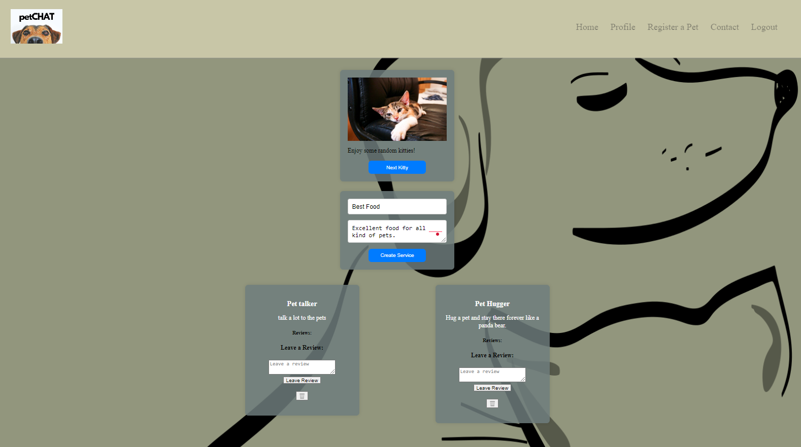
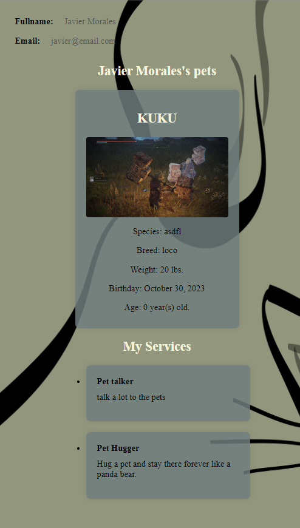
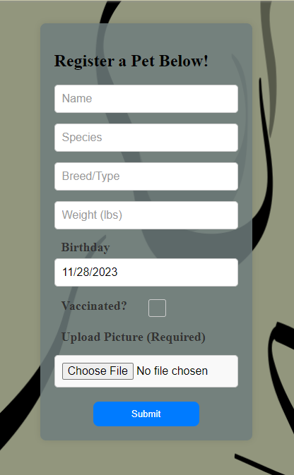
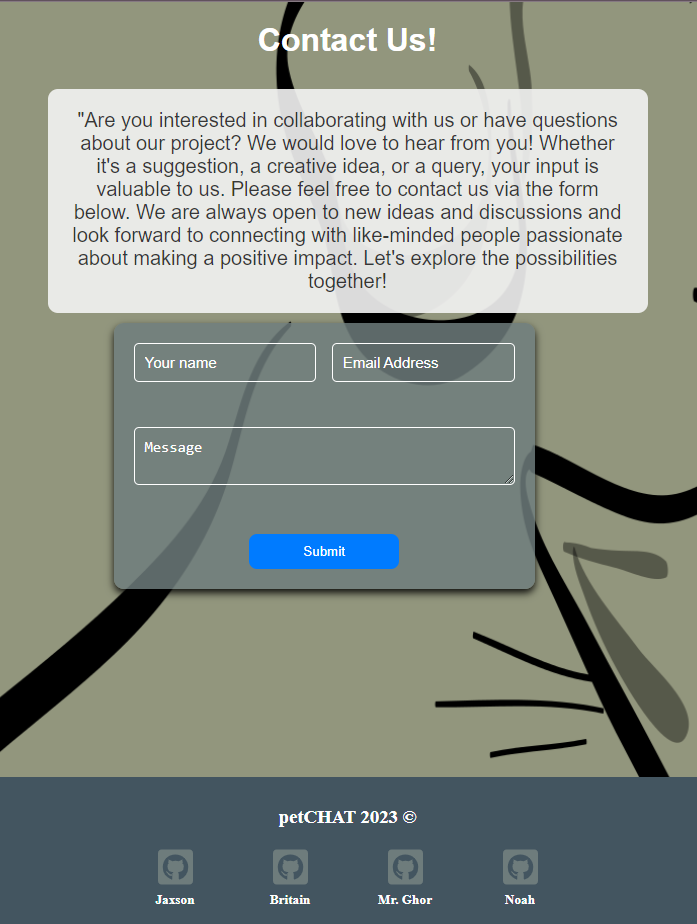

# Pet Chat Project

  

## Description
This project is an online meeting place for pet enthusiasts, where you can gush about your furry friends and share all those cute and fun moments. Imagine a place where you can find or offer interesting services like pet grooming or even find someone to take care of your pet when you are away. Additionally, you can leave reviews on these services to know who's meowing in pet care. It's more than just a place; is a community where you can connect, exchange advice, and support each other in the incredible adventure of pet ownership.

  

  

  

## Table of Content
  * [Description](#description)
  * [Technologies](#technologies)
    * [Core Stack](#core-stack)
    * [Key Libraries and Frameworks](#key-libraries-and-frameworks)
    * [Styling and UI](#styling-and-ui)
    * [Additional Utilities](#additional-utilities)
  * [Installation](#installation)
  * [License](#license)
  * [Resources](#resources)
  * [Deployment](#deployment)
  * [Contribution](#contribution)
  * [Contact](#contact)

  ## Technologies
 Our project is built upon the robust MERN stack, integrating a suite of cutting-edge technologies and libraries to deliver a seamless and dynamic user experience. Below is a breakdown of our tech stack:

#### Core Stack
1. MongoDB: A powerful NoSQL database.
2. Express.js: Efficient server-side web application framework for Node.js.
3. React: A JavaScript library for building interactive user interfaces.
4. Node.js: A JavaScript runtime built on Chrome's V8 JavaScript engine.

#### Key Libraries and Frameworks
* Apollo Client & Server: Sophisticated GraphQL management.
* GraphQL: A query language for APIs.
* Mongoose: MongoDB object modeling for Node.js.
* bcrypt: Secure password hashing.
* dotenv: Environment variable management.
* jsonwebtoken: Securely transmitting information as JSON objects.
* Vite: Next generation frontend tooling.
* React Router: Declarative routing for React applications.

#### Styling and UI
* Bootstrap & React-Bootstrap: For responsive design and pre-styled components.
* FontAwesome: Comprehensive set of icons.
* SASS: Powerful CSS extension language.

#### Additional Utilities
* Firebase: For versatile cloud services.
* Email.js: Client-side email integration.
* UUID: For generating unique identifiers.
* react-toastify: Elegant notifications and prompts.
* eslint: Static code analysis to improve code quality.

This comprehensive set of technologies ensures our project is not only functional and responsive but also secure and scalable.

## Installation
For the installation clone the repository and run "npm install".
To open the app use the command "npm run develop", the app will open automatically to the broswer windoe and, optionally, the backend to check the database with GraphQL can be used to.

## License

## Resources

* https://www.mongodb.com/
* https://expressjs.com/
* https://react.dev/
* https://nodejs.org/en/docs
* https://www.apollographql.com/docs/react/
* https://graphql.org/learn/
* https://mongoosejs.com/docs/index.html
* https://www.npmjs.com/package/bcrypt
* https://www.npmjs.com/package/dotenv
* https://www.npmjs.com/package/jsonwebtoken
* https://vitejs.dev/
* https://reactrouter.com/en/main
* https://getbootstrap.com/
* https://fontawesome.com/
* https://sass-lang.com/
* https://firebase.google.com/
* https://www.emailjs.com/
* https://www.npmjs.com/package/uuid
* https://fkhadra.github.io/react-toastify/introduction/
* https://eslint.org/

## Deployment
This project will be deploy temporary in Heroku:
* https://pet-chat-8dcd7234f1ae.herokuapp.com/

## Contribution
If you would like to collaborate on this project for future development, please contact any of the four developers in the Contact section down below. We will be more than happy to heard other people's insights about how to improve this amazing project.

## Contact

For Collaborations or any inquiry, please contact any of the four developers listed here:
* https://github.com/britaing - Britain Gilgour
* https://github.com/noahsimcoe - Noah Simcoe
* https://github.com/Jaxson20 - Jaxson Fellhauer
* https://github.com/elchinatalpf - Javier Morales

